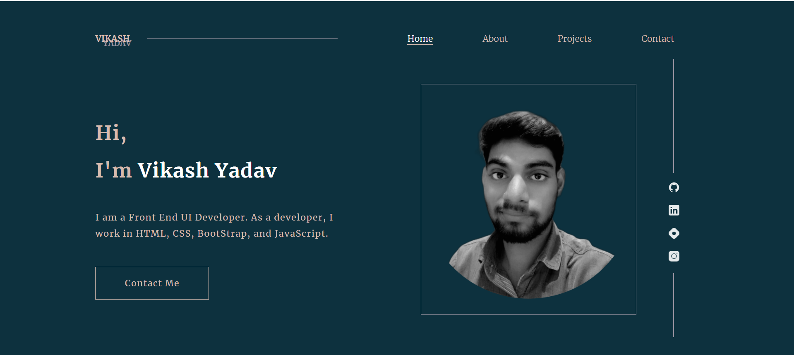

# My Portofolio Website

Hello, I'm **Vikash Yadav** 

This is my portfolio website. I have used **HTML, CSS and little bit JavaScript**. This site is fully responsive.

### **What I have learned ?**

While developing this site I have learnt about the
- CSS tramsform 3D perspective property
- media queries
- responsive layout
- third party email integration.

**[Portfolio live netlify link](https://vikash-yadav-portfolio-website.netlify.app/ "Website link")**

